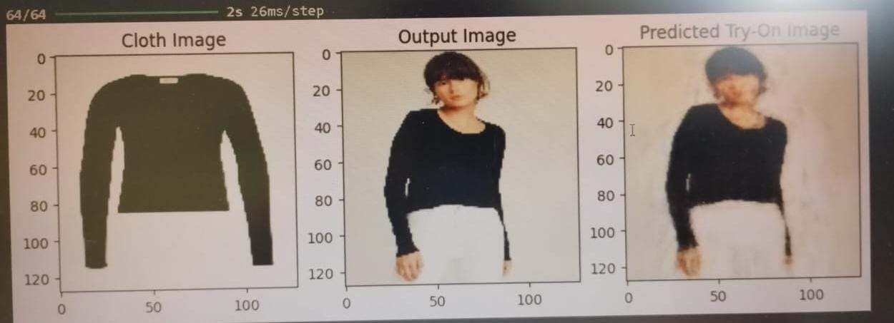
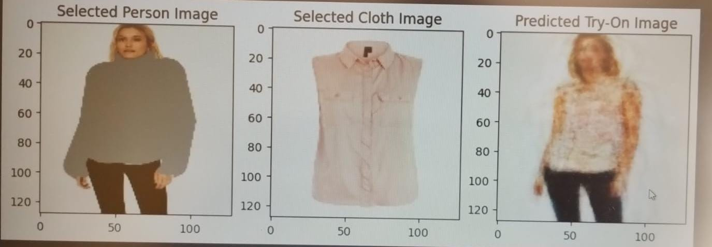
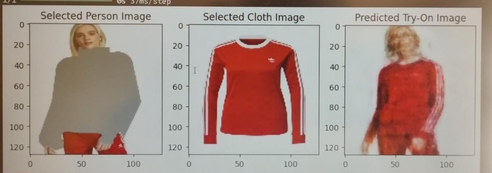
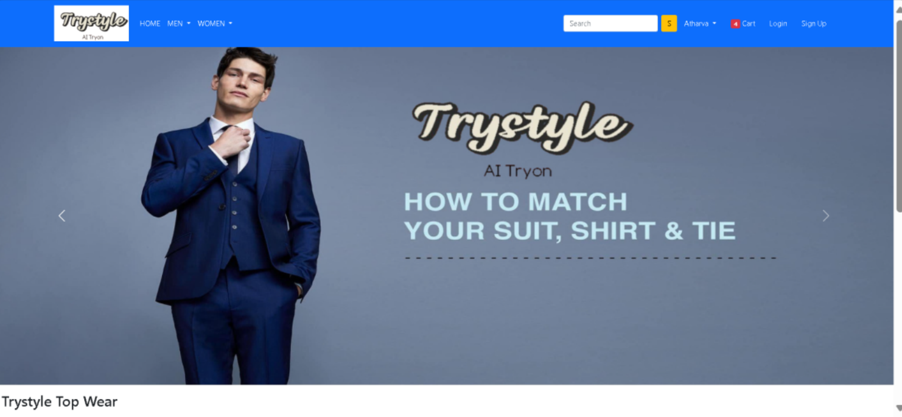

# 🛍️ Trystyle – AI-Powered Virtual Try-On E-commerce Website

Welcome to **Trystyle**, a full-stack e-commerce platform with **AI Virtual Try-On technology**. Users can view clothing on models virtually before purchasing — bringing a real-life dressing room experience online.

### 👗 Virtual Try-On Results


 
  
 

---

### 🛍️ Website Interface

#### 🔹 Homepage


#### 🔸 Product Detail Page


---

## 🛠️ Tech Stack

- **Frontend**: HTML, CSS, Bootstrap
- **Backend**: Django (Python)
- **AI Model**: PyTorch-based Virtual Try-On (e.g., VITON, CP-VTON)
- **Database**: SQLite3
- **Deployment**: Localhost/Django server

---

## 🧪 How to Run

### 1. Clone the Repo
```bash
git clone https://github.com/your-username/trystyle-ai-tryon.git
cd trystyle-ai-tryon
